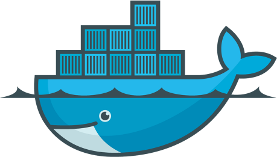

***
# Desde la perspectiva de desarrollo
---
## Desde la perspectiva de desarrollo

* Si bien cada proyecto es un mundo diferente, trataremos de dar ejemplos que se
  dan en gran parte de los proyectos de desarrollo
  * El primero considera el deploy automatizado
  * Luego hablaremos de cómo simplificar el desarrollo en ambientes complejos:
      * Usando Vagrant
      * Usando Docker
* A su vez, trataremos de ir introduciendo el concepto de inmutabilidad
---
# Automatizando los deploys
---
## Automatizando los deploys
* Esta tarea tiene como objetivo automatizar la tarea de instalar/actualizar una
  aplicación en un servidor remoto teniendo en cuenta todas las consideraciones
  necesarias
  * Incluso cuando la aplicación se compone de varias componentes distribuidas
* No todos los desarrollos tienen las mismas necesidades
  * Realizar un build
  * Publicar artefacto
  * Instalar dependencias
  * Subir/Descargar código/artefacto
  * Correr scripts
---
## Un ejemplo: Capistrano

*A remote server automation and deployment tool written in Ruby*

```ruby
role :demo, %w{srv-01 srv-02 srv-03}
task :uptime do
  on roles(:demo), in: :parallel do |host|
    uptime = capture(:uptime)
    puts "#{host.hostname} reports: #{uptime}"
  end
end
```

<small class="fragment">
[Ver ejemplo](images/samples/01-capistrano/00-sample/config/deploy.rb)
</small>
---
## Uso de capistrano

```bash
cap install # Inicializa el directorio
cap -T # Lista todas las posibles tareas disponibles
```

* Instaura la noción de ambientes
  * Por defecto inicializa dos ambientes: *production y staging*
  * Los ambientes configuran los accesos
  * Las tareas son las mismas para cada ambiente

### Ejemplo de production.rb

```ruby
role :demo, %w{localhost}

server '33.33.33.10',
   roles: %w(demo),
   ssh_options: {
     user: 'vagrant',
     forward_agent: true,
     auth_methods: %w(publickey password),
     password: 'vagrant'
   }
```
---
## Uso de capistrano

* Además de los ambientes, capistrano define **roles**. Por ejemplo: *web, app, db*
  * Un servidor tiene un rol
  * En un server con un determinado rol, hay que realizar determinadas taras
    diferentes. Por ejemplo: assets en *web*, deploy en *app*, dump en *db*
* Además de las tareas predefinidas, permite extenderlo con tareas propias sean
  locales como remotas
* Las tareas predefinidas permiten realizar **deploy** y **rollback**

<small>
*Veremos ejemplos de uso de capistrano deployando en un servidor virtual con IP
__33.33.33.10__*
---
## Ejemplo de capistrano y jekyll

* [Jekyll](https://jekyllrb.com/) es uno de los tantos generadores de sitios
  estáticos
  * El website de [Mikroways](http://www.mikroways.net/) fue desarrollado con
    jekyll
* Deployaremos en la VM el sitio usando jekyll. Para ello:
  * El servidor debe tener instalado ruby
  * Se debe desacargar el código del sitio desde [GitHub](https://github.com/Mikroways/mikroways.net)
  * Se debe correr el comando `jekyll build`
  * Listo!
* Para probarlo: http://33.33.33.10

<small class="fragment">
  [Ver el ejemplo](images/samples/01-capistrano/01-jekyll/config/deploy.rb)
</small>
---
## Ejemplo de capistrano y jekyll

* Con capistrano:
  * Deployamos el sitio: `cap production deploy`
  * *Remotamente ejecutamos* `jekyll build`
  * *Localmente abrimos el navegador con al URL del sitio*
* Probamos una nueva versión del sitio
* Hacemos un rollback: `cap production deploy:rollback`
---
## Capistrano y desarrollos dinámicos
* En sitios que no son estáticos, existen archivos que deben mantenerse entre
  deploys
  * Configuración de la base de datos o software
  * Uploads o archivos generados por la aplicación
* Capistrano permite definir qué archivos y qué directorios son *compartidos*
* De aquí la estructura propuesta por capistrano es:

```bash
  base_dir
  ├── current -> /opt/sites/jekyll/releases/20160619173257
  ├── releases
  │   └── YYYYMMDDHHmmii
  ├── repo
  └── shared
```
---
## Capistrano y wordpress
* Creamos un wordpress que mantenemos localmente
  * Personalizamos el wordpress local
* Instalamos wordpress con capitrano en el servidor remoto
  * Será accesible vía http://33.33.33.10:81
* Usamos tareas personalizadas para:
  * Subir la base local a producción
  * Subir el template y uploads a producción
* Trabajamos en producción
  * Descargamos la base de producción a nuestra copia local
---
## Otras Herramientas

* [RUNDECK](http://rundeck.org/)
* [Fabric](http://www.fabfile.org/)
* [Rocketeer](http://rocketeer.autopergamene.eu/)
* [Deployer](http://deployer.org/)
---
# Vagrant

---
## Vagrant
* Simplifica la **configuración**, **reproducibilidad** y **portabilidad**
  de ambientes sobre diferentes estándares industriales
* Controla estos ambientes mediante un simple workflow que maximiza la
  productividad y flexibilidad
* Aisla las dependencias y sus configuraciones en un ambiente consistente y
  descartable
* Disponible para:
  * Mac OS X
  * Windows
  * Linux
---
## Vagrant providers

* Virtualbox
* Hyper-V
* VMWare
* AWS
* Docker
---
## Vagrant provisioners

* File
* Shell
* Ansible
* CFEngine
* Chef
* Puppet
* Docker
* Salt
---
## Comandos Vagrant

```bash
vagrant up
vagrant destroy
vagrant ssh
vagrant provision
vagrant reload [--provision]
vagrant box list
```
---
## Multimachine

Esta funcionalidad permite iniciar varias VMs en un mismo `Vagrantfile`
permitiendo así simular ambientes complejos
---
## Ejemplos vagrant

*__shell provisioning__*


```ruby
Vagrant.configure(2) do |config|
  config.vm.box = "chef/ubuntu-14.04"
  config.vm.box_check_update = false
  config.vm.network "private_network", ip: "33.33.34.10"

  config.vm.provision "shell", inline: <<-SHELL
     sudo apt-get update
     sudo apt-get install -y apache2
  SHELL
end
```
<small class="fragment">
[Ejemplo de un server con apache](images/samples/02-vagrant/01-simple/Vagrantfile)
</small>
---
## Ejemplos vagrant

*__Multimachine (4 vms) con docker y shell provisioning__*

```ruby
Vagrant.configure(2) do |config|
  config.vm.define 'master', primary: true do |app|
    app.vm.box = "chef/ubuntu-14.04"
    app.vm.network "private_network", ip: "33.33.35.10"
    app.vm.provision "docker" do |d|
      ...
    end
  end    
  (1..3).each do |num|
    config.vm.define "node-#{num}" do |app|
      app.vm.box = "chef/ubuntu-14.04"
      app.vm.network "private_network", ip: "33.33.35.1#{num}"
      app.vm.provision "docker" do |d|
        ...
      end
    end
  end
```

<small class="fragment">
[Ejemplo de un cluster de Docker Swarm](images/samples/02-vagrant/02-multi-machines/Vagrantfile)
</small>
---
## Ejemplos vagrant

*__AWS provider con Chef__*

<small>
Antes de poder utilizar este provider es necesario instalar el plugin que provee
esta funcionalidad
</small>

```bash

  vagrant plugin install vagrant-aws

  # Se usa un box dummy
  vagrant box add dummy \
    https://github.com/mitchellh/vagrant-aws/raw/master/dummy.box

  vagrant up --provider=aws

```
---
## Ejemplo vagrant y AWS

```ruby
Vagrant.configure("2") do |config|
  config.vm.box = "dummy"
  config.vm.provider :aws do |aws,override|
    aws.ami = "ami-7747d01e"
    aws.access_key_id = ENV['AWS_ACCESS_KEY']
    aws.secret_access_key = ENV['AWS_SECRET_KEY']
    aws.keypair_name = 'car'
    override.ssh.username = "ubuntu"
    override.ssh.private_key_path = "#{ENV['HOME']}/.ssh/id_rsa"
  end
  config.vm.provision :chef_solo do |chef|
    chef.run_list = [
      'recipe[apt]',
      'recipe[my_rancher]'
    ]
  end
end
```
<small class="fragment">
`vagrant rsync` _- Requiere este comando si algo se modifica -_
<br />
[Ejemplo de servidor Rancher](images/samples/02-vagrant/03-aws/Vagrantfile)
</small>
---
# Docker

---
## Docker
* Permite correr contenedores linux aislados **sólo** en Linux
* Promueve la portabilidad, permitiendo contenedores autosuficientes que son
  creados a partir de las necesidades de una aplicación
* Basados en el concepto de inmutabilidad
* Los contenedores usados en desarrollo pueden usarse en ambientes de testing y
  producción
  * Minimiza la brecha entre desarrollo e infraestructura
* Puede utilizarse para aplicaciones gráficas

```bash
docker run -v ~/workspace/:/home/eclipse/workspace/ \
  -e DISPLAY -v /tmp/.X11-unix:/tmp/.X11-unix:ro \
  -d leesah/eclipse
```
---
## Conceptos Docker
* Docker funciona a partir de:
  * **Docker engine:** set de herramientas de gestión del ambiente docker:
    servicio docker, contenedores, imagenes
  * **Docker hub/registry:** repositorio de imágenes públicas o privadas a partir
    de donde creamos contenedores
---
## Comandos docker

```bash
docker search
docker images
docker pull
docker run
docker ps
docker diff
docker commit
docker inspect
docker log
```
---
## Ejemplo

**Iniciamos una instancia de Mysql con docker**

```bash
docker run -p 33060:3306 -e MYSQL_ROOT_PASSWORD=devops -d mysql:5.7

mysql -u root -h 127.0.0.1 --port 33060 -pdevops
```
<small class="fragment">
*¿Qué sucede si eliminamos el contenedor?*
</small>
---
## Volumenes en docker
```bash
docker volume  ls
docker volume create
docker volume rm
docker volume inspect
```
---
## Docker compose

Se describe una aplicación compuesta por más de un contenedor mediante un **yml**

```yml
version: "2"
services:
  wordpress:
    image: wordpress
    links:
      - db:mysql
    ports:
      - 8080:80
  db:
    image: mysql:5.7
```
<small class="fragment">
[Ver ejemplo completo](images/samples/03-docker/docker-compose.yml)
</small>
---
## Comandos docker compose

```bash
docker-compose up
docker-compose ps
docker-compose stop
docker-compose rm
docker-compose scale
```

***
